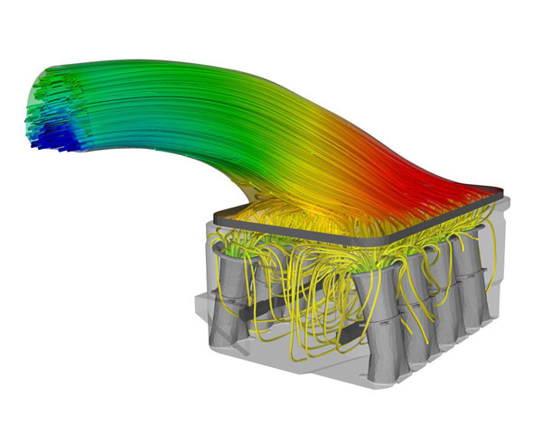

# University Courses

Below is a list of the courses I currently teach:

## **Introduction to Python Programming**
Learn the basics of Python with applications tailored for engineering and science students.

## **Finite Element Analysis (FEA)**
Understand FEA fundamentals and explore simulation techniques for mechanical systems.

## **Computational Fluid Dynamics (CFD)**
Dive into fluid behavior simulation using ANSYS Fluent and other tools.

## **Aerodynamics for Vehicles**
Analyze the aerodynamic performance of vehicles and develop optimized designs.

## **Engineering Simulations with Python**
Apply Python-based approaches to solve complex engineering problems.
